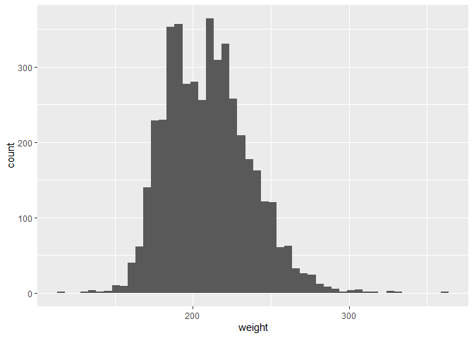
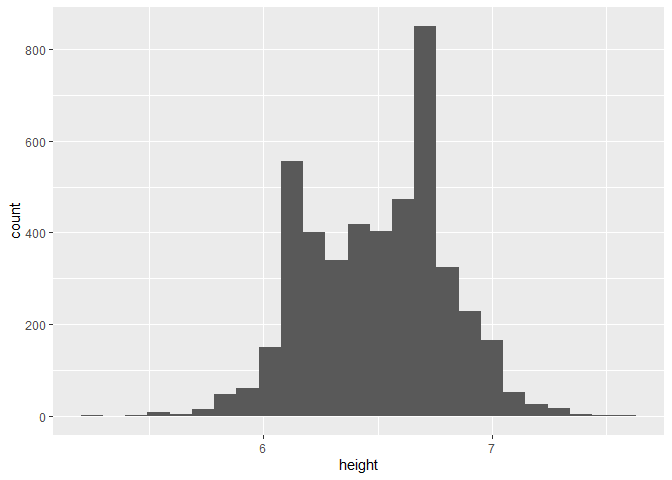
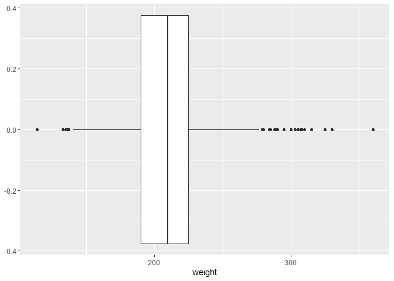
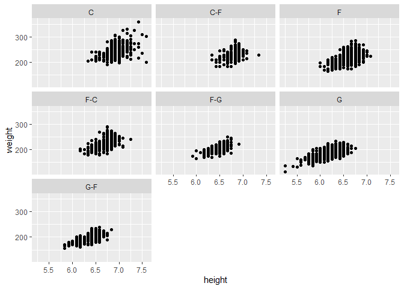

First, load packages.


```r
library(tidyverse)
library(ggplot2)
library(dplyr)
library(tidytuesdayR)
library(scales)
```

Second, grab the data.


```r
player_data <- read.csv("player_data.xls")
players <- read.csv("Players.xls")
seasons_stats <- read.csv("Seasons_Stats.csv")
```

Grab the player name, year, and team. 

```r
nba <- seasons_stats %>%
  select(Year, Player, Tm) %>%
  filter(!is.na(Year)) #remove NAs 
```

What are the range of years? 


```r
summary(nba$Year)
```

```
##    Min. 1st Qu.  Median    Mean 3rd Qu.    Max. 
##    1950    1981    1996    1993    2007    2017
```

Which player stayed with a team the longest? (1950-2017)

```r
nba %>%
  count(Player,Tm, sort=TRUE) %>%
  head(20)
```

```
##                  Player  Tm  n
## 1           Kobe Bryant LAL 20
## 2         Dirk Nowitzki DAL 19
## 3        John Stockton* UTA 19
## 4            Tim Duncan SAS 19
## 5          Karl Malone* UTA 18
## 6        Reggie Miller* IND 18
## 7      Hakeem Olajuwon* HOU 17
## 8        John Havlicek* BOS 16
## 9           Tony Parker SAS 16
## 10        Manu Ginobili SAS 15
## 11       Patrick Ewing* NYK 15
## 12          Paul Pierce BOS 15
## 13      David Robinson* SAS 14
## 14       Dolph Schayes* SYR 14
## 15          Jerry West* LAL 14
## 16          Joe Dumars* DET 14
## 17 Kareem Abdul-Jabbar* LAL 14
## 18        Kevin Garnett MIN 14
## 19       Robert Parish* BOS 14
## 20        Udonis Haslem MIA 14
```

What is the distribution of how long a player stays with a team?


```r
nba %>%
  count(Player,Tm, sort=TRUE) %>%
  ggplot(aes(Player,n)) +
  geom_line()
```

<!-- -->

Who played for the most teams?

```r
nba %>%
  count(Player,Tm)%>%
  count(Player, sort=TRUE) %>%
  head(20)
```

```
##              Player  n
## 1    George Johnson 14
## 2   Tony Massenburg 14
## 3      Chucky Brown 13
## 4       Jim Jackson 13
## 5         Joe Smith 13
## 6       Kevin Ollie 13
## 7      Lou Amundson 12
## 8        Mike James 12
## 9    Aaron Williams 11
## 10      Damon Jones 11
## 11      Drew Gooden 11
## 12     Earl Boykins 11
## 13 Gerald Henderson 11
## 14        Ish Smith 11
## 15       John Lucas 11
## 16      Mark Bryant 11
## 17  Reggie Williams 11
## 18   Rod Strickland 11
## 19     Andre Miller 10
## 20 Anthony Goldwire 10
```
There were three (3) George Johnsons in the NBA.

```r
player_data %>%
  filter(name=="George Johnson")
```

```
##             name year_start year_end position height weight        birth_date
## 1 George Johnson       1971     1974        C   6-11    245     June 19, 1947
## 2 George Johnson       1973     1986      C-F   6-11    205 December 18, 1948
## 3 George Johnson       1979     1986      F-C    6-7    210  December 8, 1956
##                              college
## 1 Stephen F. Austin State University
## 2                 Dillard University
## 3              St. John's University
```

Which means Tony Massenburg is the player who has played on the most teams (14). 

```r
player_data %>%
  filter(name == "Tony Massenburg")
```

```
##              name year_start year_end position height weight    birth_date
## 1 Tony Massenburg       1991     2005        F    6-9    220 July 31, 1967
##                  college
## 1 University of Maryland
```

Which 14 teams did he play for? 

```r
nba %>% 
  filter(Player=="Tony Massenburg") %>%
  count(Year, Tm, sort=TRUE)
```

```
##    Year  Tm n
## 1  1991 SAS 1
## 2  1992 BOS 1
## 3  1992 CHH 1
## 4  1992 GSW 1
## 5  1992 SAS 1
## 6  1992 TOT 1
## 7  1995 LAC 1
## 8  1996 PHI 1
## 9  1996 TOR 1
## 10 1996 TOT 1
## 11 1997 NJN 1
## 12 1998 VAN 1
## 13 1999 VAN 1
## 14 2000 HOU 1
## 15 2001 VAN 1
## 16 2002 MEM 1
## 17 2003 UTA 1
## 18 2004 SAC 1
## 19 2005 SAS 1
```

Histogram for height of players: 


```r
player_data %>%
  filter(!is.na(height))%>%
  count(height) 
```

```
##    height   n
## 1           1
## 2    5-10  48
## 3    5-11  61
## 4     5-3   2
## 5     5-5   1
## 6     5-6   2
## 7     5-7   6
## 8     5-8   3
## 9     5-9  15
## 10    6-0 150
## 11    6-1 229
## 12   6-10 324
## 13   6-11 229
## 14    6-2 327
## 15    6-3 401
## 16    6-4 340
## 17    6-5 418
## 18    6-6 403
## 19    6-7 473
## 20    6-8 426
## 21    6-9 424
## 22    7-0 164
## 23    7-1  52
## 24    7-2  26
## 25    7-3  13
## 26    7-4   4
## 27    7-5   4
## 28    7-6   2
## 29    7-7   2
```
Tansform the `height` column. Split it up into feet and inches, then mutate to create decimal height (in feet).


```r
player_data <- player_data %>%
  separate(height,c("feet","inches"))
```

```
## Warning: Expected 2 pieces. Missing pieces filled with `NA` in 1 rows [2143].
```

```r
str(player_data)
```

```
## 'data.frame':	4550 obs. of  9 variables:
##  $ name      : chr  "Alaa Abdelnaby" "Zaid Abdul-Aziz" "Kareem Abdul-Jabbar" "Mahmoud Abdul-Rauf" ...
##  $ year_start: int  1991 1969 1970 1991 1998 1997 1977 1957 1947 2017 ...
##  $ year_end  : int  1995 1978 1989 2001 2003 2008 1981 1957 1948 2018 ...
##  $ position  : chr  "F-C" "C-F" "C" "G" ...
##  $ feet      : chr  "6" "6" "7" "6" ...
##  $ inches    : chr  "10" "9" "2" "1" ...
##  $ weight    : int  240 235 225 162 223 225 220 180 195 190 ...
##  $ birth_date: chr  "June 24, 1968" "April 7, 1946" "April 16, 1947" "March 9, 1969" ...
##  $ college   : chr  "Duke University" "Iowa State University" "University of California, Los Angeles" "Louisiana State University" ...
```

```r
player_data <- player_data %>%
  mutate(height = as.numeric(feet)+as.numeric(inches)/12) # this creates the height column as numeric. 
```


```r
player_data %>%
  filter(!is.na(weight))%>%
  ggplot(aes(weight))+
  geom_histogram(bins=50)
```

<!-- -->

```r
player_data %>%
  filter(!is.na(height))%>%
  ggplot(aes(height))+
  geom_histogram(bins=25)
```

<!-- -->

```r
player_data %>%
  filter(!is.na(weight))%>%
  ggplot(aes(weight))+
  geom_boxplot()
```

<!-- -->


```r
player_data %>%
  filter(!is.na(weight))%>%
  filter(!is.na(height))%>%
  ggplot(aes(height,weight))+
  geom_point()+
  facet_wrap(.~position)
```

<!-- -->

