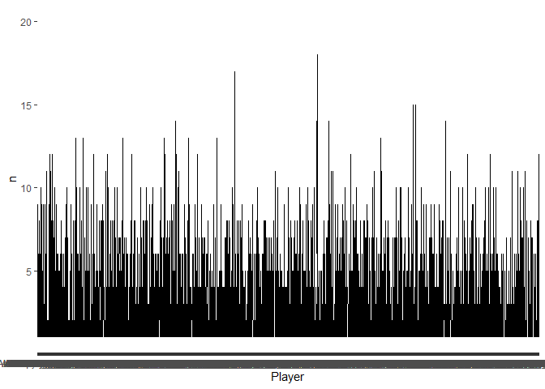

First, load packages.


```r
library(tidyverse)
library(ggplot2)
library(dplyr)
library(tidytuesdayR)
library(scales)
```

Second, grab the data.


```r
player_data <- read.csv("player_data.xls")
players <- read.csv("Players.xls")
seasons_stats <- read.csv("Seasons_Stats.csv")
```

Grab the player name, year, and team. 

```r
nba <- seasons_stats %>%
  select(Year, Player, Tm) %>%
  filter(!is.na(Year)) #remove NAs 
```

What are the range of years? 


```r
summary(nba$Year)
```

```
##    Min. 1st Qu.  Median    Mean 3rd Qu.    Max. 
##    1950    1981    1996    1993    2007    2017
```

Which player stayed with a team the longest? (1950-2017)

```r
nba %>%
  count(Player,Tm, sort=TRUE) %>%
  head(20)
```

```
##                  Player  Tm  n
## 1           Kobe Bryant LAL 20
## 2         Dirk Nowitzki DAL 19
## 3        John Stockton* UTA 19
## 4            Tim Duncan SAS 19
## 5          Karl Malone* UTA 18
## 6        Reggie Miller* IND 18
## 7      Hakeem Olajuwon* HOU 17
## 8        John Havlicek* BOS 16
## 9           Tony Parker SAS 16
## 10        Manu Ginobili SAS 15
## 11       Patrick Ewing* NYK 15
## 12          Paul Pierce BOS 15
## 13      David Robinson* SAS 14
## 14       Dolph Schayes* SYR 14
## 15          Jerry West* LAL 14
## 16          Joe Dumars* DET 14
## 17 Kareem Abdul-Jabbar* LAL 14
## 18        Kevin Garnett MIN 14
## 19       Robert Parish* BOS 14
## 20        Udonis Haslem MIA 14
```

What is the distribution of how long a player stays with a team?


```r
nba %>%
  count(Player,Tm, sort=TRUE) %>%
  ggplot(aes(Player,n)) +
  geom_line()
```

<!-- -->

Who played for the most teams?

```r
nba %>%
  count(Player,Tm)%>%
  count(Player, sort=TRUE) %>%
  head(20)
```

```
##              Player  n
## 1    George Johnson 14
## 2   Tony Massenburg 14
## 3      Chucky Brown 13
## 4       Jim Jackson 13
## 5         Joe Smith 13
## 6       Kevin Ollie 13
## 7      Lou Amundson 12
## 8        Mike James 12
## 9    Aaron Williams 11
## 10      Damon Jones 11
## 11      Drew Gooden 11
## 12     Earl Boykins 11
## 13 Gerald Henderson 11
## 14        Ish Smith 11
## 15       John Lucas 11
## 16      Mark Bryant 11
## 17  Reggie Williams 11
## 18   Rod Strickland 11
## 19     Andre Miller 10
## 20 Anthony Goldwire 10
```
There were three (3) George Johnsons in the NBA.

```r
player_data %>%
  filter(name=="George Johnson")
```

```
##             name year_start year_end position height weight        birth_date
## 1 George Johnson       1971     1974        C   6-11    245     June 19, 1947
## 2 George Johnson       1973     1986      C-F   6-11    205 December 18, 1948
## 3 George Johnson       1979     1986      F-C    6-7    210  December 8, 1956
##                              college
## 1 Stephen F. Austin State University
## 2                 Dillard University
## 3              St. John's University
```

Which means Tony Massenburg is the player who has played on the most teams (14). 

```r
player_data %>%
  filter(name == "Tony Massenburg")
```

```
##              name year_start year_end position height weight    birth_date
## 1 Tony Massenburg       1991     2005        F    6-9    220 July 31, 1967
##                  college
## 1 University of Maryland
```

Which 14 teams did he play for? 

```r
nba %>% 
  filter(Player=="Tony Massenburg") %>%
  count(Tm, sort=TRUE)
```

```
##     Tm n
## 1  SAS 3
## 2  VAN 3
## 3  TOT 2
## 4  BOS 1
## 5  CHH 1
## 6  GSW 1
## 7  HOU 1
## 8  LAC 1
## 9  MEM 1
## 10 NJN 1
## 11 PHI 1
## 12 SAC 1
## 13 TOR 1
## 14 UTA 1
```

